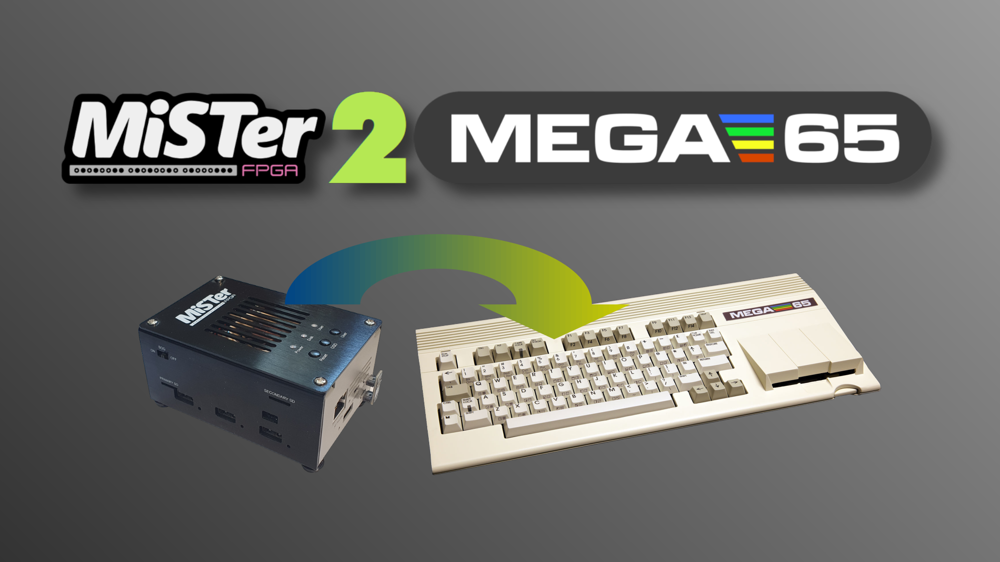

MiSTer2MEGA65
=============

MiSTer2MEGA65 is a framework to simplify porting MiSTer cores to the MEGA65.

Learn more by
[watching this YouTube video](https://youtu.be/9Ib7z64z9N4)
and get started by reading the
[MiSTer2MEGA65 Wiki](https://github.com/sy2002/MiSTer2MEGA65/wiki).

TL;DR
-----

1. Scroll up and press the "Use this template" button to start a new
   MiSTer2MEGA65 project. Then fork the MiSTer core you want to port
   and make it a Git submodule of your newly created project.

2. Wrap the MiSTer core inside `CORE/vhdl/main.vhd` while
   adjusting the clocks in `CORE/vhdl/clk.vhd`. Provide RAMs, ROMs and other
   devices in `CORE/vhdl/mega65.vhd` and wire everything correctly.

3. Configure your core's behavior, including how the start screen looks like,
   what ROMs should be loaded (and where to), the abilities of the
   <kbd>Help</kbd> menu and more in `CORE/vhdl/config.vhd` and in
   `CORE/vhdl/globals.vhd`.

**DONE** your core is ported to MEGA65! :-)

*Obviously, this is a shameless exaggeration of how easy it is to work with
MiSTer2MEGA65, but you get the gist of it.*

Getting started, detailed documentation and support
---------------------------------------------------

1. You might whant to start your journey
  [here](https://github.com/sy2002/MiSTer2MEGA65/wiki/1.-What-is-MiSTer2MEGA65)
  and then follow the reading track that is pointed out in the
  respective chapters.

2. Run through this tutorial: https://files.mega65.org?ar=898d573b-d30d-4438-8893-09455bd16400

3. Choose the MiSTer core you want to port here: https://mister-devel.github.io/MkDocs_MiSTer/

4. Use [The Ultimate MiSTer2MEGA65 Porting Guide](https://github.com/sy2002/MiSTer2MEGA65/wiki/The-Ultimate-MiSTer2MEGA65-Porting-Guide) to do the actual work. The guide contains all steps "From Zero to Hero".

Status of the framework
-----------------------

**The MiSTer2MEGA (M2M) framework is stable and ready for being used.**
The reference implementation of the M2M framework is the
[Commodore 64 for MEGA65](https://github.com/MJoergen/C64MEGA65).
Additionally there is already
[a decent amount of cores](https://cores.mega65.org)
that are based on the M2M framework. Head to the
[Alternate MEGA65 cores](https://sy2002.github.io/m65cores/)
website to learn more.

[The Ultimate MiSTer2MEGA65 Porting Guide](https://github.com/sy2002/MiSTer2MEGA65/wiki/The-Ultimate-MiSTer2MEGA65-Porting-Guide)
is very comprehensive - if you miss something or have questions, contact us on Discord.

The [Commodore 64 for MEGA65](https://github.com/MJoergen/C64MEGA65) is the reference implementation
of the M2M framework and [The Ultimate MiSTer2MEGA65 Porting Guide](https://github.com/sy2002/MiSTer2MEGA65/wiki/The-Ultimate-MiSTer2MEGA65-Porting-Guide) uses it heavily to provide you with examples. Don't hesitate to take code snippets from the
[Commodore 64 for MEGA65](https://github.com/MJoergen/C64MEGA65) for your own projects.
nd join the
[friendly MEGA65 community on Discord](https://discord.com/channels/719326990221574164/1177364456896999485).
